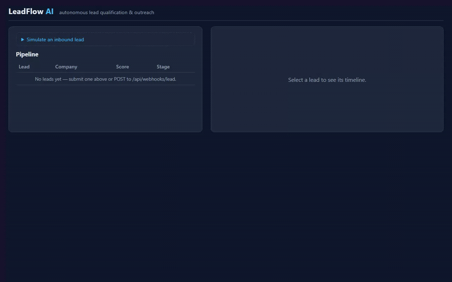
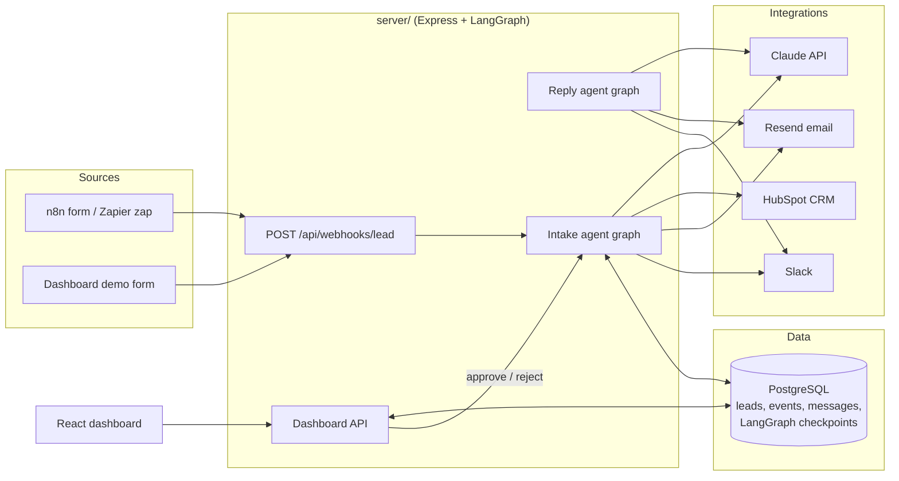

# LeadFlow AI

An autonomous lead-generation and qualification agent for B2B sales teams. Inbound leads arrive through a webhook (n8n form, Zapier Zap, or any HTTP client), and a LangGraph-powered agent runs the entire top-of-funnel workflow with a single human checkpoint:

```
Lead arrives (form / webhook)
  → enrich   — scrape the lead's company website for context
  → qualify  — Claude rates the lead against a configurable ICP rubric;
               a deterministic weighted formula turns ratings into a 0-100 score and hot/warm/cold tier
  → CRM sync — upsert the contact + qualification note into HubSpot
  → draft    — Claude writes a personalized outreach email
  → approve  — pipeline pauses (durably, in Postgres) until a human approves/edits/rejects in the dashboard
  → send     — email goes out via Resend; hot leads ping Slack
  → replies  — a second agent classifies responses (interested / question / opt-out)
               and answers, escalates to a human, or unsubscribes accordingly
```

This is the business-automation counterpart to [NutriGuide AI](https://github.com/rjacaac211/nutriguide-ai) (a conversational RAG agent): together they cover conversational AI *and* autonomous business-process agents.

## Demo



*A lead comes in, gets scored/tiered by Claude against the ICP rubric, synced to HubSpot, drafted for outreach, approved by a human, sent, and replied to — end to end, one pass.*

<details>
<summary>How this demo was recorded (for re-recording later)</summary>

1. `docker compose up --build`, wait for `/health` to return OK, open http://localhost:5173.
2. Click "Simulate an inbound lead" to expand the form.
3. Click the **Hot example** preset chip, then **Submit lead**.
4. Wait for "Lead submitted — the agent is qualifying it now," then wait for the new row
   in the Pipeline table (5s poll; qualification + enrichment + CRM sync take ~10-30s).
5. Click the row. Narrate the score/tier badge and qualification rationale as they appear.
6. Wait for stage "Needs approval" — the Approval card appears with a drafted subject/body.
7. Edit a line of the draft to show it's editable, then click **Approve & send**.
8. Wait for stage "Outreach sent" — "Simulate a reply from this lead" appears (hidden before this).
9. Expand it, click the **Interested** preset chip, click **Send reply**.
10. Wait for `Classified as "interested".` and stage moving to "Escalated".
11. Stop recording.

</details>

## Highlights

| Area | What this project demonstrates |
|------|-------------------------------|
| **Autonomous AI agents** | LangGraph.js `StateGraph` pipelines that execute a multi-step business task end-to-end with minimal human intervention |
| **Human-in-the-loop** | LangGraph `interrupt()` + Postgres checkpointer — approval pauses survive restarts and redeploys; humans edit drafts before anything is sent |
| **Lead gen & qualification** | Configurable ICP rubric (`icp.config.json`); LLM rates evidence per criterion, deterministic code computes the weighted score — auditable, not vibes |
| **CRM integration** | HubSpot contacts + notes via REST (free-tier compatible), idempotent upsert by email |
| **Messaging platforms** | Outbound email via Resend, hot-lead / handoff notifications via Slack incoming webhooks |
| **Workflow automation tools** | Committed n8n workflow export + optional n8n service in docker-compose; the same webhook works as a Zapier action (documented below) |
| **Customer inquiry handling** | Reply-handling agent classifies intent and answers product questions, escalates interested leads to a human, honors opt-outs |
| **LLM engineering** | Anthropic Claude via `@langchain/anthropic`, zod structured outputs everywhere, per-call token/cost logging, model swappable by env var |
| **Production practices** | Structured JSON logging (pino), graceful mock mode for every integration, unit-tested pure logic, typecheck + test + build CI, Docker Compose |
| **Stack** | TypeScript, LangGraph.js, Express, Prisma/PostgreSQL, React + Vite |

## Architecture



Two services:

- **`server/`** — TypeScript. Express API + two LangGraph graphs in one process. Prisma models (`Lead`, `LeadEvent` audit trail, `OutreachMessage`) share a PostgreSQL database with the LangGraph `PostgresSaver` checkpointer, so an in-flight approval pause is just data — restart the process and the pipeline resumes where it left off.
- **`web/`** — React + Vite dashboard: live pipeline table, per-lead timeline (every agent decision is recorded as an event), approval queue with an editable draft, and demo forms to simulate inbound leads and replies.

### Agent design notes

- **Deterministic scoring on top of LLM judgment.** The LLM only does what LLMs are good at — reading evidence and rating each rubric criterion 0-5 with a rationale (zod-enforced structured output). The weighted 0-100 score, tier thresholds, and disqualification cutoff are plain unit-tested TypeScript (`server/src/agent/scoring.ts`), so scoring is explainable and tunable without touching a prompt.
- **The approval gate is a real interrupt, not a status flag.** `interrupt()` checkpoints the graph mid-run into Postgres. `POST /api/leads/:id/approve` resumes it with a `Command({ resume })` carrying the (possibly edited) subject/body. Server restarts between draft and approval are harmless.
- **Every integration degrades to mock mode.** Missing `HUBSPOT_ACCESS_TOKEN` / `RESEND_API_KEY` / `SLACK_WEBHOOK_URL` turns that step into a logged no-op, so the full pipeline demos with only an Anthropic key. The audit trail records `mock: true` so you always know what really happened.
- **Failures don't lose leads.** CRM outages are caught, recorded as `crm_sync_failed` events, and the pipeline continues; enrichment is best-effort; webhook capture responds `202` and runs the agent in the background.

## Quick Start

Prerequisites: Docker + an Anthropic API key. (Or Node 22+ and PostgreSQL 16 for local dev.)

```bash
git clone https://github.com/rjacaac211/leadflow-ai.git
cd leadflow-ai
cp .env.example .env          # set ANTHROPIC_API_KEY (everything else optional)
docker compose up --build
```

- Dashboard: http://localhost:5173
- API: http://localhost:4000 (`GET /health`)

Submit a lead from the dashboard ("Simulate an inbound lead"), or hit the webhook directly:

```bash
curl -X POST http://localhost:4000/api/webhooks/lead \
  -H "Content-Type: application/json" \
  -H "X-API-Key: $WEBHOOK_API_KEY" \
  -d '{
    "name": "Jordan Rivera",
    "email": "jordan@acme-saas.example",
    "company": "Acme SaaS",
    "website": "https://example.com",
    "message": "Our 12-rep sales team forecasts in spreadsheets and it is falling apart. Looking to fix this quarter."
  }'
```

Within a few seconds the lead appears in the dashboard scored and tiered, with a drafted outreach email waiting for your approval. Approve it (edit freely first), then use "Simulate a reply" to watch the reply agent classify and respond.

### Local development (without Docker)

```bash
# server
cd server
npm install
npx prisma generate         # regenerates the Prisma client — required after npm install
npx prisma migrate deploy   # needs DATABASE_URL pointing at a running Postgres
npm run dev                 # tsx watch, port 4000

# web (second terminal)
cd web
npm install
npm run dev                 # Vite on 5173, proxies /api to :4000
```

## Configuration

All configuration is environment variables (see [`.env.example`](.env.example)) plus one JSON file:

- **`icp.config.json`** — the ideal-customer-profile rubric: product pitch, target customer, weighted criteria, tier thresholds, and the disqualification cutoff. Edit it to point the agent at a different product/market; no code changes needed.
- **`ANTHROPIC_MODEL`** — defaults to `claude-opus-4-8`. If you switch models, add a pricing entry in `server/src/agent/llm.ts` so cost logging stays accurate.

| Variable | Required | Purpose |
|----------|----------|---------|
| `ANTHROPIC_API_KEY` | ✅ | Claude — qualification, drafting, reply handling |
| `DATABASE_URL` | ✅ | PostgreSQL (app tables + LangGraph checkpoints) |
| `WEBHOOK_API_KEY` | recommended | Shared secret for `/api/webhooks/*` (open with a warning if unset — dev only) |
| `HUBSPOT_ACCESS_TOKEN` | optional | HubSpot account-scoped token; unset = mock mode |
| `RESEND_API_KEY`, `OUTREACH_FROM_EMAIL` | optional | Outbound email; unset = mock mode |
| `SLACK_WEBHOOK_URL` | optional | Hot-lead / handoff notifications; unset = mock mode |

Notes on the optional integrations, from setting each of these up live:

- **HubSpot** — HubSpot's UI has moved private-app creation from "Private Apps" to **Settings → Integrations → Development → Keys → Service Keys** (public beta as of Feb 2026); it issues the same `pat-na1-...`-style bearer token, so no code changes are needed either way. Only the `crm.objects.contacts.read` and `crm.objects.contacts.write` scopes are required — there's no separate notes scope exposed in the scope picker; the Notes API is governed by the contacts scopes.
- **Resend** — on an unverified (sandbox) account, Resend only allows sending **to the exact email address you signed up with** (not even a `+alias` variant of it) — a platform restriction, not a bug. Verify a domain to send to arbitrary recipients.

## Automation Platforms

### n8n (demonstrated)

[`automation/n8n-lead-capture-workflow.json`](automation/n8n-lead-capture-workflow.json) is a committed n8n export: a hosted lead-capture form that posts submissions to the LeadFlow webhook with the `X-API-Key` header.

```bash
docker compose --profile automation up   # starts n8n on http://localhost:5678
```

Import the JSON via n8n → Workflows → Import from File, activate it, and share the form URL. The workflow reads the webhook key from the `LEADFLOW_WEBHOOK_KEY` env var (already wired in docker-compose).

### Zapier (compatible)

The intake endpoint is a plain authenticated webhook, so any Zapier trigger (Facebook Lead Ads, Typeform, Google Forms…) can feed it with a **Webhooks by Zapier → Custom Request** action:

- **Method/URL:** `POST https://your-host/api/webhooks/lead`
- **Headers:** `Content-Type: application/json`, `X-API-Key: <your WEBHOOK_API_KEY>`
- **Data:** `{"name": "...", "email": "...", "company": "...", "website": "...", "message": "...", "source": "zapier"}`

Field names are forgiving — the payload normalizer accepts common variants (`full_name`, `first_name`+`last_name`, `email_address`, `company_name`, `url`, `notes`, …).

## API

| Endpoint | Auth | Description |
|----------|------|-------------|
| `POST /api/webhooks/lead` | `X-API-Key` | Capture a lead; responds `202`, pipeline runs in background |
| `POST /api/webhooks/email-reply` | `X-API-Key` | `{email, message}` — run the reply agent for an inbound response |
| `GET /api/leads` | — | Pipeline list (dashboard) |
| `GET /api/leads/:id` | — | Lead + full event timeline + messages |
| `POST /api/leads/:id/approve` | — | Resume a paused pipeline; optional `{subject, body}` overrides |
| `POST /api/leads/:id/reject` | — | Resume with rejection; optional `{reason}` |
| `GET /health` | — | Liveness + DB check |

The dashboard API is unauthenticated by design for the local demo — put it behind your reverse proxy's auth (or a VPN) before exposing it.

## Testing & CI

```bash
cd server && npm run typecheck && npm test   # vitest — 17 unit tests on pure logic
cd web && npm run build
```

Unit tests cover the deterministic core (weighted scoring/tiering, webhook payload normalization, HTML-to-text extraction) and need no database, network, or API keys. GitHub Actions ([`.github/workflows/ci.yml`](.github/workflows/ci.yml)) runs typecheck + tests + web build on every PR and push to `main`.

## Project Structure

```
├── icp.config.json              # the qualification rubric — edit to retarget the agent
├── docker-compose.yml           # postgres + server + web (+ optional n8n)
├── automation/
│   └── n8n-lead-capture-workflow.json
├── server/
│   ├── prisma/schema.prisma     # Lead, LeadEvent (audit trail), OutreachMessage
│   └── src/
│       ├── agent/
│       │   ├── graph.ts         # StateGraphs, Postgres checkpointer, run/resume API
│       │   ├── nodes.ts         # enrich → qualify → crmSync → draft → approve → send; reply pipeline
│       │   ├── scoring.ts       # pure weighted scoring + tiering (unit tested)
│       │   ├── llm.ts           # Claude factory + token/cost logging
│       │   └── state.ts         # graph state annotations
│       ├── integrations/        # hubspot, resend, slack, enrichment — all with mock mode
│       ├── routes/              # webhooks, leads (approve/reject resume)
│       └── services/leads.ts    # webhook payload normalization (unit tested)
└── web/                         # React dashboard: pipeline, timeline, approval queue
```

## Roadmap

- Offline eval harness for qualification accuracy against a labeled lead set (LLM-as-judge + score deltas), wired to CI like NutriGuide's
- Scheduled follow-up sequences (no-reply after N days → follow-up draft)
- Multi-channel outreach (LinkedIn task creation) and richer enrichment providers
- Deployment guide (ECS/EC2) mirroring NutriGuide's AWS pipeline
- Harden pipeline resume when a node *after* the approval gate (e.g. `send`) fails — today the `interrupt()` is already consumed by the first resume, so a transient failure (bad recipient, provider outage) leaves the lead stuck with no way to retry via `approve`/`reject`
